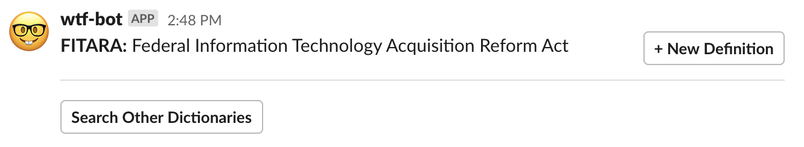

# wtf-bot

A Slackbot for looking up acronyms by typing `/wtf`.

### Features:

* Store acronyms in GitHub as a CSV
* Dictionary cached for speed
* Open pull requests with new definitions from within Slack
* Search across multiple acronym dictionaries at once
* Support multiple Slacks from a single instance
* Text API for command line use
* Deploy to [Cloud.gov](https://cloud.gov)

## Develop

### macOS

1. Install rbenv and Redis: `brew install rbenv redis`
2. Build Ruby: `rbenv install`
3. Install gems: `bundle install`
4. Start development server: `foreman start`
5. (optional) Install ngrok: `brew cask install ngrok`
6. (optional) Expose development server to a public url: `ngrok http 5000`

## Deploy

1. Configure the application prefix by copying `example-vars.yml` to `vars.yml` and editing
2. [Set up the Cloud Foundry CLI and log in to Cloud.gov](https://cloud.gov/docs/getting-started/setup/#set-up-the-command-line)
3. Install the Create-Service-Push plugin: `cf install-plugin Create-Service-Push`
4. Push the app to Cloud.gov: `cf csp --vars-file vars.yml --push-as-subprocess`

There is an issue that prevents the `DATABASE_URL` environment variable from being automatically derived from the `VCAP_SERVICES` variable. Find the URI by running `cf env [app name]` and inspecting `VCAP_SERVICES`, but replace "redis://" with "rediss://" or else the connection will fail. Manually set `DATABASE_URL` to use that URI (`cf set-env [app name] DATABASE_URL [redis_uri]`) and restart the app (`cf rs [app name]`).

## Configure

We configure wtf-bot using a JSON environment variable `WTF_BOT_SETTINGS` or a text file with the name `settings.yml`. Check out `example-settings.yml` for a starting point. We'll explore each of the configuration options in the sections below.

### GitHub

#### Acronym respository

We'll store the acronym dictionaries that power wtf-bot as CSV files on GitHub.

[Create a new repository.](https://github.com/new) In `settings.yml`, we'll add a new `dictionaries` item, and set its `repo` to point to our new repository. `name` can be anything; this text will be used to refer to the dictionary in the Slack interface.

At a minimum, the repository must contain a file called `acronyms.csv`. The CSV should have at least two columns. The first column contains an acronym; the second contains a definition. The first row of the CSV will be ignored; it is assumed to be a header.

Next, we'll want to configure a webhook to inform wtf-bot when the dictionary has been changed. From the repository, click Settings, then Webhooks, then Add Webhook.

The Payload URL should be `[server]/github/webhook`, where `[server]` is the URL of wtf-bot; if running locally, this is the URL shown by ngrok in step 6. Select "application/json" for the Content type. The Secret should be a random string (we can make a new one with `ruby -rsecurerandom -e 'puts SecureRandom.hex(20)'`). The other options can be left as their defaults.

Save the random secret as the `webhook_secret` of our dictionary in `settings.yml`.

#### Bot user

In order to propose new definitions from within Slack or via the text API, we'll create a new GitHub user to open pull requests on our behalf. (We could alternatively use our own user account, but this is not recommended.)

[Create a new account](https://github.com/join), perhaps in a private/incognito browser window. The email address cannot be shared by another account.

From the new bot user account, [create a new personal access token](https://github.com/settings/tokens/new). Provided the acronym repository is public, we only need to give the token the "public_repo" scope. Save the token as the `access_token` of our dictionary in `settings.yml`.

Finally, we'll need to add the bot user as a collaborator with "Write" access to the acronym repository. We'll do this from our own user account by going to Settings > Manage access > Invite a collaborator in the acronym repository.

### Slack

We'll create a new Slack app to connect to wtf-bot. Open [Your Apps](https://api.slack.com/apps), and ensure that you are signed in to the workspace to which you want to add wtf-bot. Click "Create New App." Name the app "wtf-bot" and select your workspace from the dropdown menu.

In `settings.yml`, we'll add a new `slacks` item, and set its `name` to the name of our workspace. `dictionary` is the index of the dictionary we want to use as the default for this workspace, so if we want to use the first dictionary in `dictionaries`, we'd set `dictionary` to 0. We can also optionally specify per-channel dictionaries as shown in `example-settings.yml` using `channels`, including using regular expressions to match multiple channels.

From the Basic Information page of our Slack app, we'll show and save the Signing Secret as `secret` in `settings.yml`.

In the Display Information section of the Basic Information page, we'll add an App Icon. We can use `slack-icon.png` for this purpose.

Next, we'll create a new Slash Command to summon wtf-bot in Slack. From the Slash Commands page, click Create New Command. The Command should be `/wtf`. The Request URL should be `[server]/slack/commands`, where `[server]` is the URL of wtf-bot; if running locally, this is the URL shown by ngrok in step 6. Use "Look up an acronym" as the Short Description, and "[acronym]" as the Usage Hint.

In order to interact with wtf-bot, we'll enable Interactivity on the Interactivity & Shortcuts page. The Request URL shoudl be `[server]/slack/actions`.

Finally, we'll install the app. Select Install App to Workspace on the Install App page. Click Allow when prompted. Copy the Bot User OAuth Access Token and save it as the `access_token` of our Slack in `settings.yml`.

### Text API

There are no restrictions on GET requests to the wtf-bot API, but if we want to submit a new definition, we'll need an API key.

We'll add new API keys to the `api_keys` list in `settings.yml`. `name` can be anything; it will be used to indicate the author of new definitions. `token` should be a random string (we can make a new one with `ruby -rsecurerandom -e 'puts SecureRandom.hex(20)'`).

## API

### GET /text/[dictionary]/[acronym]

Find the definition(s) of an acronym.

`curl localhost:5000/text/[dictionary]/[acronym]`

### POST /text/[dictionary]/[acronym]

Open a pull request with a new definition of an acronym.

`curl -X POST -H "Authorization: Token [token]" --data-urlencode "definition=[definition]" localhost:5000/text/[dictionary]/[acronym]`
